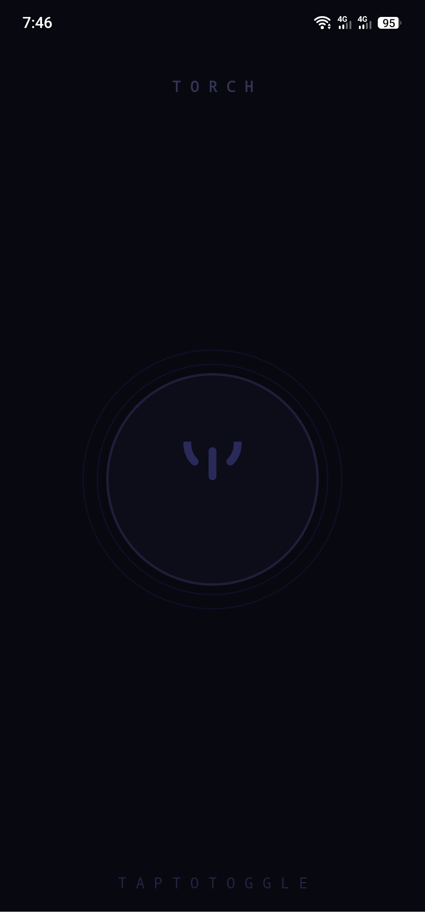
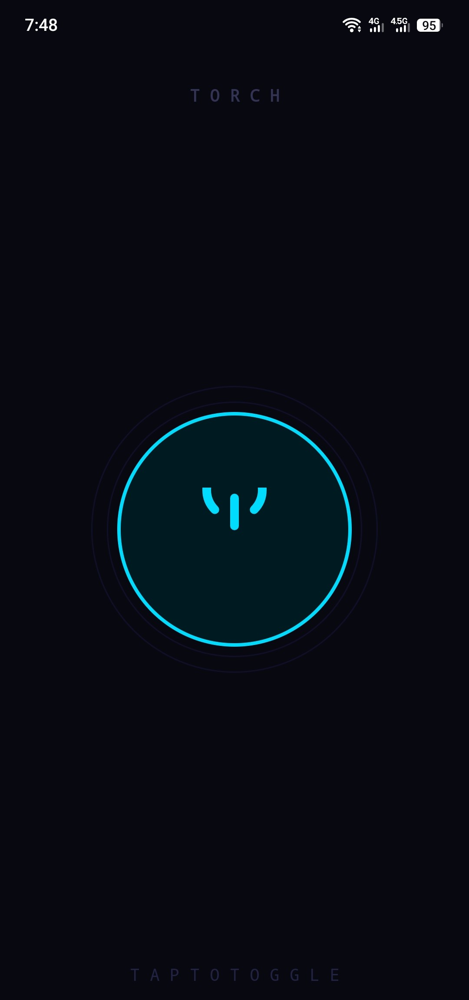

# 🔦 Torch — Flashlight App for Android

A clean, minimal flashlight app for Android built with Java and the Camera2 API. Features a creative dark-themed UI with a circular power button, pulse ring animations, brightness slider, and automatic torch cleanup on app exit.

## 📱 Screenshots

### OFF State


### ON State


Dark circular button with dim power icon  
Cyan-glowing button with pulse rings

---

## ✨ Features

- One-tap power button — toggles the flashlight instantly
- Pulse ring animations — visual feedback when torch is active
- Brightness slider — adjust torch intensity (enabled only when ON)
- Auto-off on exit — torch safely turns off when you leave the app
- No-flash device detection — graceful message if device has no flash
- Minimal permissions — only camera permission required

---

## 🛠️ Tech Stack

| Layer | Technology |
|---|---|
| Language | Java |
| Min SDK | API 21 (Android 5.0 Lollipop) |
| Target SDK | API 34 (Android 14) |
| Layout | ConstraintLayout |
| Camera API | Camera2 (CameraManager) |
| UI | Custom XML drawables + Vector icons |

---

## 📂 Project Structure

```text
FlashlightApp/
├── Pictures/
│   ├── off_state.jpeg
│   └── on_state.jpeg
│
├── app/
│   ├── src/
│   │   └── main/
│   │       ├── java/com/example/flashlight/
│   │       │   └── MainActivity.java        ← All torch logic lives here
│   │       ├── res/
│   │       │   ├── layout/
│   │       │   │   └── activity_main.xml    ← Full UI layout
│   │       │   ├── drawable/
│   │       │   │   ├── ic_power_off.xml     ← Power icon (dim)
│   │       │   │   ├── ic_power_on.xml      ← Power icon (cyan)
│   │       │   │   ├── btn_off.xml          ← Button background OFF
│   │       │   │   ├── btn_on.xml           ← Button background ON
│   │       │   │   ├── btn_ripple.xml       ← Ripple + state selector
│   │       │   │   └── ring_deco.xml        ← Decorative rings
│   │       │   ├── color/
│   │       │   │   └── btn_text_selector.xml
│   │       │   └── values/
│   │       │       ├── colors.xml
│   │       │       └── strings.xml
│   │       └── AndroidManifest.xml
│   └── build.gradle
└── README.md
```

---

## 🚀 Getting Started

### Prerequisites

- Android Studio Hedgehog (2023.1.1) or newer
- Android device or emulator with a flash unit
- Java 8 or higher

---

## Installation

### Clone the repository

```bash
git clone https://github.com/ibrahim-codes1/Flashlight.git
cd Flashlight
```

### Open in Android Studio

- Go to File → Open
- Select the project folder
- Wait for Gradle to sync

### Run the app

- Connect a physical Android device (recommended — emulators have no flash)
- Click the green Run button or press Shift + F10

---

## 🔐 Permissions

Declared in AndroidManifest.xml:

```xml
<uses-permission android:name="android.permission.CAMERA" />

<uses-feature
    android:name="android.hardware.camera.flash"
    android:required="true" />
```

Note: The CAMERA permission is required by CameraManager to access the torch. No photos or video are ever captured.

---

## 💡 How It Works

### Core Logic — MainActivity.java

```text
App Launch
    │
    ├─► Check: does device have flash?
    │       └─ No  → show Toast, disable button, return
    │       └─ Yes → get cameraId from CameraManager
    │
    └─► User taps ToggleButton
            ├─ isChecked = true  → setTorchMode(cameraId, true)   // ON
            └─ isChecked = false → setTorchMode(cameraId, false)  // OFF

App goes to background (onStop)
    └─► setTorchMode(cameraId, false)  // Safety auto-off
```

### Key Method

```java
cameraManager.setTorchMode(cameraId, isOn);
```

This single Camera2 API call handles everything — no SurfaceTexture, no camera session needed.

---

## 🎨 UI Design

The UI uses a dark space theme (#080810 background) with cyan accents (#00DCFF).

| Element | OFF State | ON State |
|---|---|---|
| Background | #080810 | #080810 |
| Button fill | #0D0D1A | #001A22 |
| Button border | #1E1E3A | #00DCFF |
| Power icon | #2A2A5A | #00DCFF |
| Status text | STANDBY gray | ACTIVE cyan |
| Pulse rings | Hidden | Animated outward |

---

## ⚠️ Known Limitations

| Issue | Explanation |
|---|---|
| No emulator support | Android emulators don't have a real camera flash |
| Brightness control | setTorchMode only supports ON/OFF on most devices; true brightness control requires Camera2 capture sessions (advanced) |
| One camera only | App always uses getCameraIdList()[0] — rear camera |

---

## 🔮 Planned Features

- Strobe / flicker mode
- SOS morse code mode
- Home screen widget
- Lock screen shortcut
- Timer auto-off (1 min / 5 min / 10 min)
- True brightness control via CaptureRequest

---

## 🧑‍💻 Author

**Ibrahim Sheikh**

GitHub: https://github.com/ibrahim-codes1  
LinkedIn: www.linkedin.com/in/muhammad-ibrahim-89b474288


---

## 📄 License

MIT License

Copyright (c) 2025 Ibrahim Sheikh

Permission is hereby granted, free of charge, to any person obtaining a copy
of this software and associated documentation files (the "Software"), to deal
in the Software without restriction, including without limitation the rights
to use, copy, modify, merge, publish, distribute, sublicense, and/or sell
copies of the Software.

---

## 🙏 Acknowledgements

- Android Camera2 API Docs
- Material Design Guidelines
- Built as part of a mobile app development learning journey 🚀
